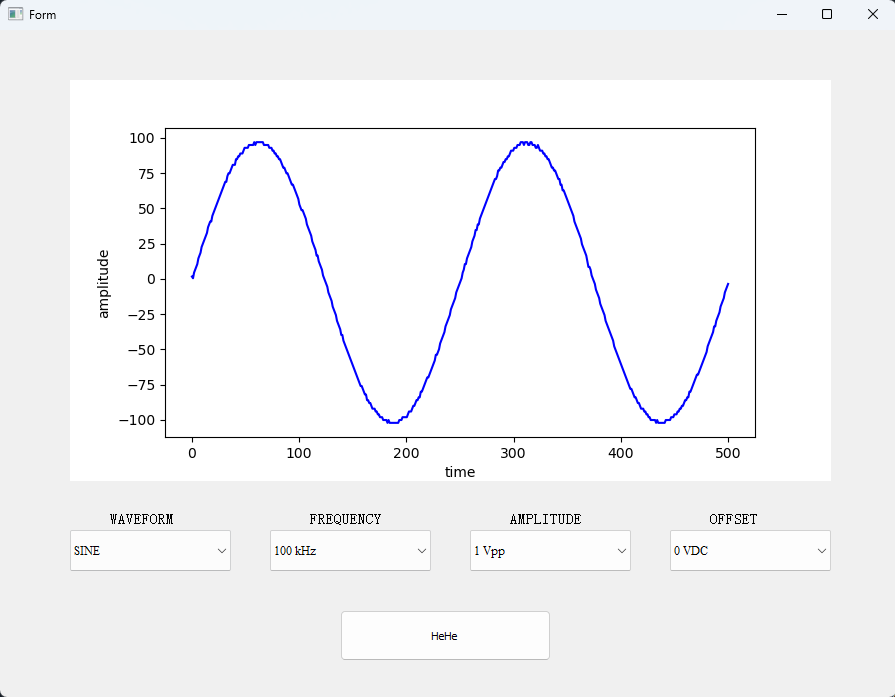
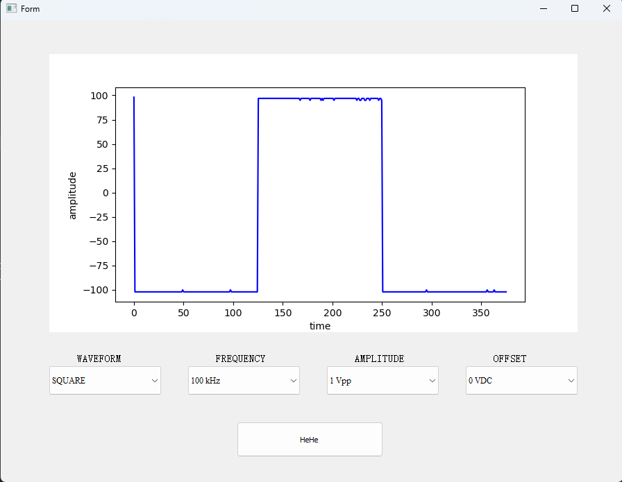

# Signal-Generation-Oscilloscope-Visualization
This project is a PyQt5-based desktop application that interfaces with a function generator and an oscilloscope using PyVISA. It allows users to configure waveform parameters, acquire measured data from the oscilloscope, and visualize the signal in real time using Matplotlib.

## Features
- Configure waveform type (sine, square, etc.)
- Set frequency, amplitude, and DC offset
- Control a function generator via SCPI commands
- Acquire waveform data from an oscilloscope
- Plot captured signal in a GUI using Matplotlib
- Simple and interactive interface

## Technologies Used
- Python 3
- PyQt5 – GUI framework
- Matplotlib – signal plotting
- PyVISA – communication with lab instruments
-NumPy – numerical data processing

